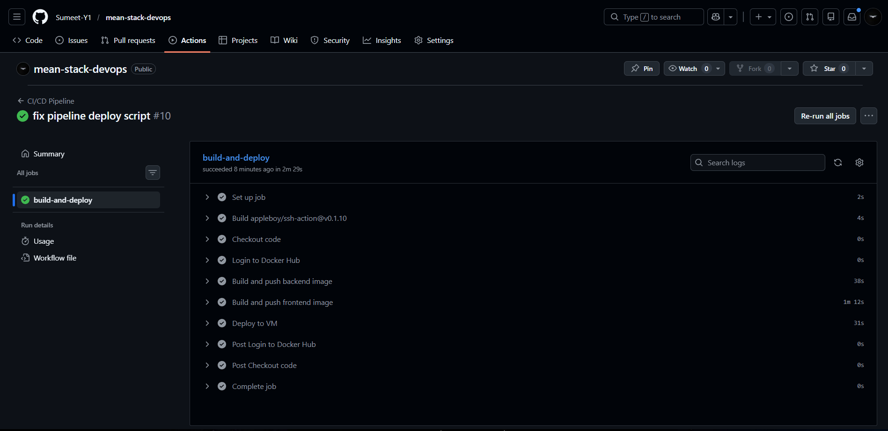
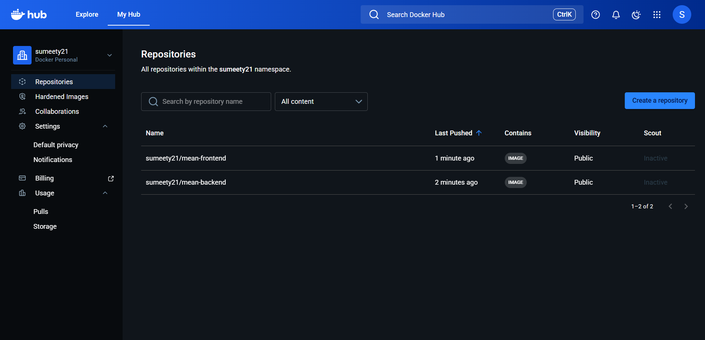
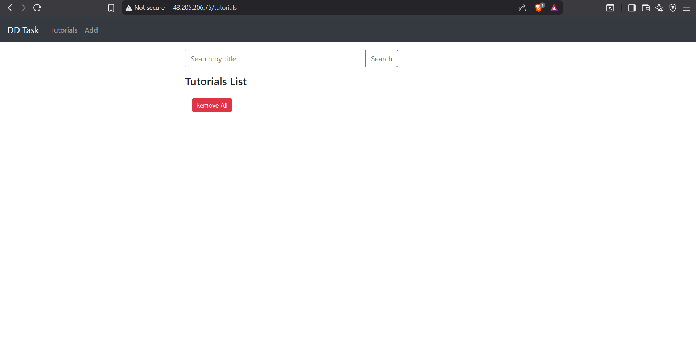
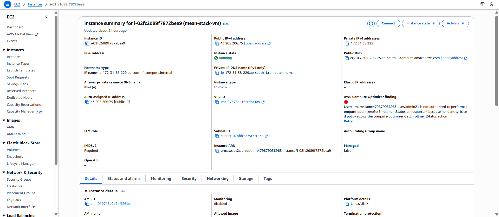
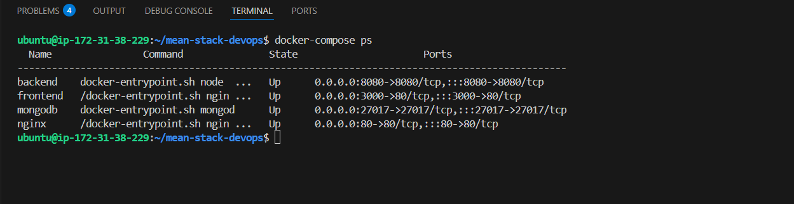

# 🚀 MEAN Stack CRUD Application - DevOps Deployment


A full-stack CRUD application built with the MEAN stack (MongoDB, Express, Angular 15, Node.js). Fully containerized with Docker, deployed on AWS EC2, and automated with a GitHub Actions CI/CD pipeline.

---

## 📚 Table of Contents

- [Tech Stack](#tech-stack)
- [Architecture](#architecture)
- [Project Structure](#project-structure)
- [Setup & Deployment](#setup--deployment)
- [CI/CD Pipeline](#cicd-pipeline)
- [Docker Images](#docker-images)
- [Infrastructure](#infrastructure)
- [Screenshots](#screenshots)

---

## 🛠️ Tech Stack

| Technology | Purpose |
|------------|---------|
| Angular 15 | Frontend UI |
| Node.js + Express | Backend REST API |
| MongoDB | Database |
| Docker + Docker Compose | Containerization |
| GitHub Actions | CI/CD Pipeline |
| Nginx | Reverse Proxy |
| AWS EC2 Ubuntu 22.04 | Cloud Hosting |

---

## 🏗️ Architecture
```
                        ┌─────────────────────────────┐
                        │        AWS EC2 VM            │
                        │                             │
User Request (Port 80)──►  Nginx (Reverse Proxy)      │
                        │      │           │          │
                        │      ▼           ▼          │
                        │  Frontend     Backend       │
                        │  Angular    Node.js:8080    │
                        │               │             │
                        │               ▼             │
                        │           MongoDB           │
                        │          :27017             │
                        └─────────────────────────────┘
```

---

## 📁 Project Structure
```
mean-stack-devops/
├── .github/
│   └── workflows/
│       └── deploy.yml          # GitHub Actions CI/CD pipeline
├── backend/
│   ├── Dockerfile              # Backend Docker image
│   ├── server.js               # Express server entry point
│   ├── package.json
│   └── app/
│       ├── config/
│       │   └── db.config.js    # MongoDB connection config
│       ├── controllers/
│       │   └── tutorial.controller.js
│       ├── models/
│       │   └── tutorial.model.js
│       └── routes/
│           └── tutorial.routes.js
├── frontend/
│   ├── Dockerfile              # Frontend Docker image
│   ├── nginx-frontend.conf     # Frontend Nginx config
│   └── src/
│       └── app/
│           ├── components/     # Angular components
│           ├── models/         # Data models
│           └── services/       # HTTP services
├── screenshots/                # Project screenshots
├── docker-compose.yml          # Multi-container setup
├── nginx.conf                  # Reverse proxy config
└── README.md
```

---

## 🚀 Setup & Deployment

### Prerequisites
- AWS EC2 Ubuntu 22.04 instance
- GitHub account
- Docker Hub account

### Step 1 - Clone the Repository
```bash
git clone https://github.com/Sumeet-Y1/mean-stack-devops.git
cd mean-stack-devops
```

### Step 2 - Install Docker on Ubuntu VM
```bash
sudo apt update
sudo apt install -y docker.io docker-compose
sudo usermod -aG docker ubuntu
newgrp docker
```

### Step 3 - Deploy with Docker Compose
```bash
docker-compose up -d
```

### Step 4 - Verify All Containers are Running
```bash
docker-compose ps
```

Expected output:
```
Name          Command            State         Ports
----------------------------------------------------------
backend    node server.js        Up      0.0.0.0:8080->8080
frontend   nginx -g daemon off   Up      80/tcp
mongodb    mongod                Up      0.0.0.0:27017->27017
nginx      nginx -g daemon off   Up      0.0.0.0:80->80
```

### Step 5 - Access the Application
```
http://<your-ec2-public-ip>
```

---

## ⚙️ CI/CD Pipeline

Every push to the `main` branch automatically triggers the pipeline:
```
Push to main
     │
     ▼
Checkout Code
     │
     ▼
Login to Docker Hub
     │
     ▼
Build Backend Image ──► Push to Docker Hub
     │
     ▼
Build Frontend Image ──► Push to Docker Hub
     │
     ▼
SSH into AWS EC2 VM
     │
     ▼
Pull Latest Images
     │
     ▼
Restart Containers ──► App Updated! ✅
```

### GitHub Secrets Required

| Secret | Description |
|--------|-------------|
| `DOCKER_USERNAME` | Docker Hub username |
| `DOCKER_PASSWORD` | Docker Hub access token |
| `VM_HOST` | AWS EC2 public IP address |
| `VM_USER` | VM SSH username (ubuntu) |
| `VM_SSH_KEY` | EC2 private key (.pem file contents) |

---

## 🐳 Docker Images

| Image | Docker Hub |
|-------|------------|
| Backend | `sumeety21/mean-backend:latest` |
| Frontend | `sumeety21/mean-frontend:latest` |
| Database | `mongo:6` (official) |
| Proxy | `nginx:alpine` (official) |

---

## ☁️ Infrastructure Details

| Component | Details |
|-----------|---------|
| Cloud Provider | AWS |
| Instance Type | t2.micro (Free Tier) |
| Operating System | Ubuntu 22.04 LTS |
| Exposed Port | 80 (HTTP via Nginx) |
| Database | MongoDB (Docker container) |
| Container Orchestration | Docker Compose |

---

## 📸 Screenshots

### ✅ CI/CD Pipeline Execution


### 🐳 Docker Hub Images


### 🌐 Application UI


### ☁️ AWS Infrastructure


### 🐋 Docker Infrastructure


---

## 👨‍💻 Author

**Sumeet** - DevOps Internship Assignment